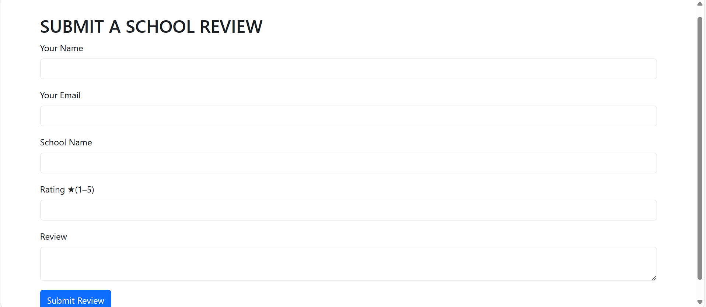
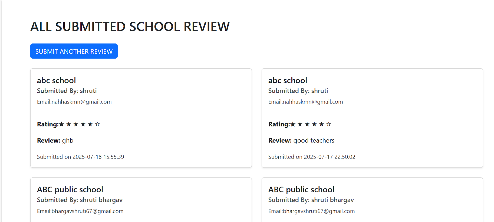

# 🏫 School Review Web App

This is a full-stack web application where users can submit and read reviews about schools. The application allows users to add a new review, search for reviews based on the school's name, and view a list of all submitted reviews.

---

## 🚀 Features

- ✅ Submit a new school review with rating (stars), name, email, and comments
- ✅ Prevents empty form submissions
- ✅ Stores all reviews in a MySQL database
- ✅ Search bar to find reviews by **school name**
- ✅ Displays all reviews submitted
- 🔒  Edit and delete functionality for reviews
- 📱 Responsive frontend with user-friendly interface

---

## 🛠️ Tech Stack

- **Frontend**: HTML, CSS, Bootstrap
- **Backend**: Flask (Python)
- **Database**: MySQL
- **Other**: Jinja2 templates

---

## 📸 Screenshots

ss1.png 
ss2.png
