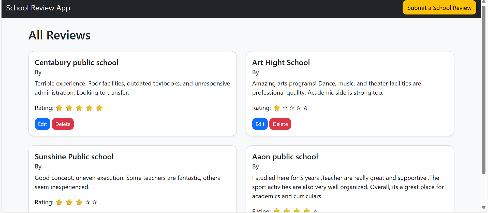
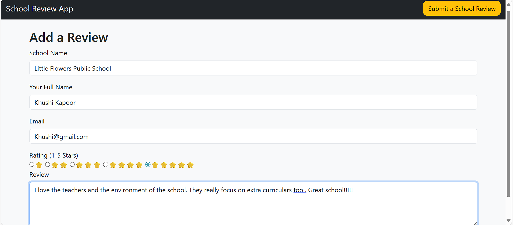
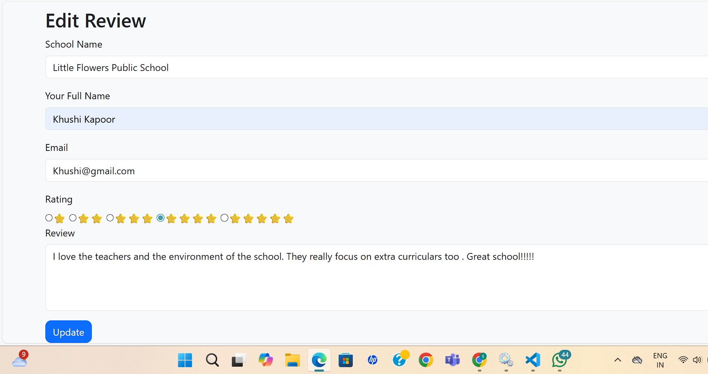
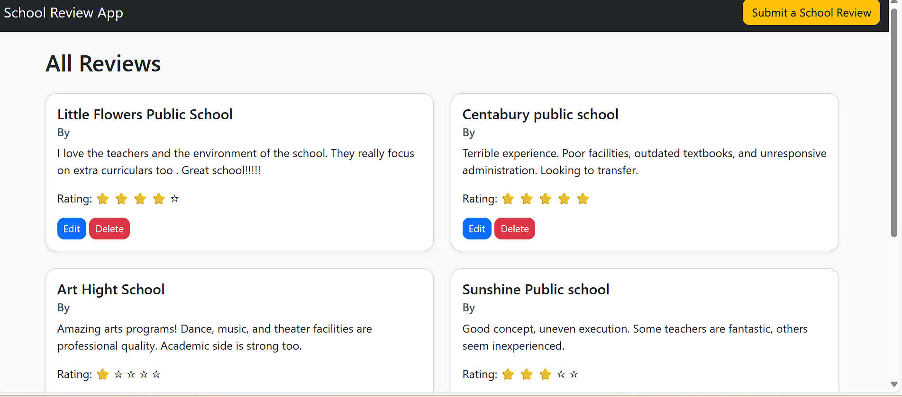
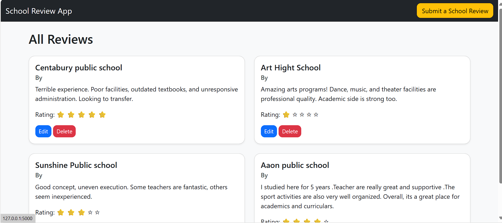

# 🏫 School Review Web App

This is a full-stack web application where users can submit and read reviews about schools. The application allows users to add a new review,edit and delete their reviews and view a list of all submitted reviews.

# 🏫 LIVE LINK : https://school-review-app-production.up.railway.app/

## 🚀 Features

- ✅ Submit a new school review with rating (stars), name, email, and review
- ✅ Prevents empty form submissions
- ✅ Stores all reviews in a MySQL database
- ✅ Displays all reviews submitted
- 🔒 Edit and delete functionality for reviews
- 📱 Responsive frontend with user-friendly interface

---

## 🛠️ Tech Stack

- **Frontend**: HTML, CSS, Bootstrap
- **Backend**: Flask (Python)
- **Database**: MySQL
- **Other**: Jinja2 templates

---

## 📸 Screenshots

### 📝 All Reviews Page
This page displays all the reviews submitted by the user in a clean list format.

---

### ➕ Add a Review Page
Here, the user can submit a new review by filling in the form.  
In this example, the review is for *Little Flower Public School*.

---

### ✏ Edit Review Page
Existing reviews can be updated by editing them here.  
In this screenshot, the *number of stars* for the review has been changed.

---

### ✅ Edited Review Confirmation
After updating a review, the changes are shown on this page.  
Here, the stars were updated from *5 to 4*.

---

### ❌ Delete Review Page
This page shows a deleted review.  
In this case, the review for *Little Flower Public School* has been removed.
